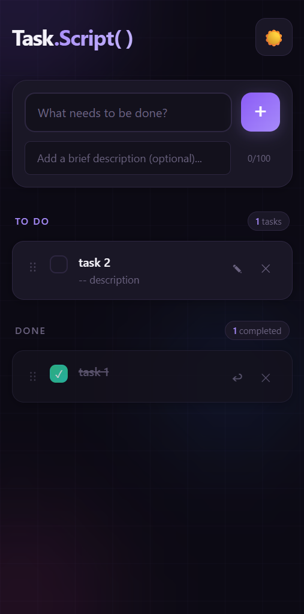
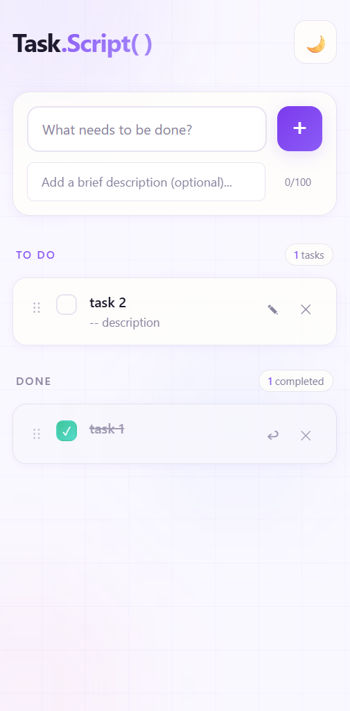

# Task.Script() Application

A modern to-do application built with TypeScript and SCSS featuring drag-and-drop, local storage persistence, and smooth animations.

## Features

- ✨ **Beautiful UI** with lilac accent colors and animated background
- 🌓 **Light/Dark theme** toggle with persistence
- 📝 **Task descriptions** - Add optional descriptions (max 100 characters)
- 🔄 **Drag and drop** to reorder tasks
- 💾 **localStorage sync** - Tasks persist across sessions
- ✅ **Separate sections** for To-Do and Completed tasks
- 🎨 **Smooth animations** throughout the app

## App Preview

Here's a quick look at the Task.Script() -

### Desktop Preview:

<video width="700" controls>
    <source src="assets/task-list-desktop.mp4" type="video/mp4">
    Your browser does not support the video tag.
</video>

### Mobile Preview:




## Getting Started

### Prerequisites

- Node.js (v14 or higher)
- npm or yarn

### Installation

1. Navigate to the task-list directory:
   ```bash
   cd task-list
   ```

2. Install dependencies:
   ```bash
   npm install
   ```

### Development

Run the development build (watches for changes):
```bash
npm run dev
```

This will:
- Watch and compile SCSS to CSS
- Watch and compile TypeScript to JavaScript

### Production Build

Build for production:
```bash
npm run build
```

### Running the App

After building, you can:

1. Start a local server:
   ```bash
   npm start
   ```

2. Or simply open `index.html` in your browser

## Project Structure

```
task-list/
├── index.html        # Main HTML file
├── styles.scss       # SCSS styles
├── styles.css        # Compiled CSS (generated)
├── app.ts            # TypeScript source
├── app.js            # Compiled JavaScript (generated)
├── package.json      # Project configuration
├── tsconfig.json     # TypeScript configuration
└── README.md         # This file
```

## Usage

1. **Add a task**: Type in the title field and optionally add a description, then press Enter or click the + button
2. **Complete a task**: Click the checkbox to move it to the Completed section
3. **Edit a task**: Hover over a task and click the edit (✎) button
4. **Delete a task**: Hover over a task and click the delete (✕) button
5. **Restore a task**: Click the restore (↩) button on completed tasks
6. **Reorder tasks**: Drag and drop tasks to rearrange them
7. **Toggle theme**: Click the sun/moon button in the header

## Technologies Used

- **TypeScript** - Type-safe JavaScript
- **SCSS** - CSS preprocessor with variables and mixins
- **HTML5** - Semantic markup
- **CSS3** - Animations, Flexbox, CSS Variables
- **localStorage** - Data persistence